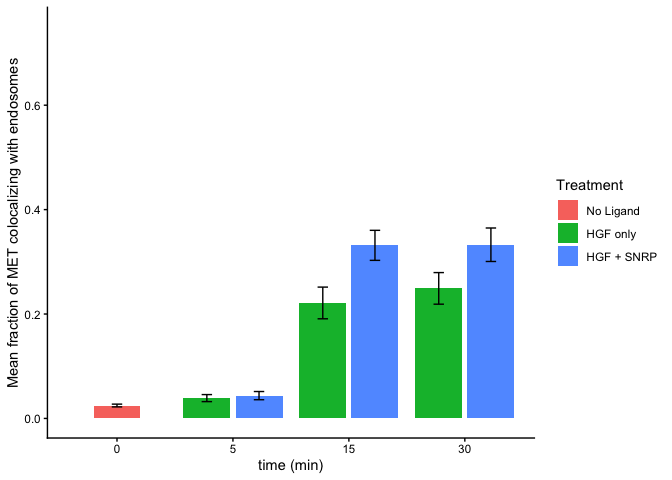

Plotting data corresponding to MET and EEA1 colocalization
================
José Liboy Lugo
2026-06-13

## Introduction

This document presents the analysis of colocalization data between MET
and EEA1 markers from fluorescent microscopy images. After image
processing on python script met_coloc_analysis.py, the results are
visualized in this document.

## Loading the data

Data was previously saved in a CSV files

``` r
library(readr)
```

    ## Warning: package 'readr' was built under R version 4.4.3

``` r
library(dplyr)
```

    ## Warning: package 'dplyr' was built under R version 4.4.3

    ## 
    ## Attaching package: 'dplyr'

    ## The following objects are masked from 'package:stats':
    ## 
    ##     filter, lag

    ## The following objects are masked from 'package:base':
    ## 
    ##     intersect, setdiff, setequal, union

``` r
library(purrr)
```

    ## Warning: package 'purrr' was built under R version 4.4.3

``` r
path_folder <- Sys.getenv("data_path")
files <- list.files(path_folder, pattern = "\\.csv$", full.names = TRUE)

data_list <- map(files, read_csv) # Read all CSV files into a list
```

    ## Rows: 18 Columns: 12

    ## ── Column specification ────────────────────────────────────────────────────────
    ## Delimiter: ","
    ## chr  (2): Sample, Treatment
    ## dbl (10): Colocalization_fraction, Norm_colocalization, Nuclei_count, MET_fo...
    ## 
    ## ℹ Use `spec()` to retrieve the full column specification for this data.
    ## ℹ Specify the column types or set `show_col_types = FALSE` to quiet this message.
    ## Rows: 20 Columns: 12
    ## ── Column specification ────────────────────────────────────────────────────────
    ## Delimiter: ","
    ## chr  (2): Sample, Treatment
    ## dbl (10): Colocalization_fraction, Norm_colocalization, Nuclei_count, MET_fo...
    ## 
    ## ℹ Use `spec()` to retrieve the full column specification for this data.
    ## ℹ Specify the column types or set `show_col_types = FALSE` to quiet this message.
    ## Rows: 33 Columns: 12
    ## ── Column specification ────────────────────────────────────────────────────────
    ## Delimiter: ","
    ## chr  (2): Sample, Treatment
    ## dbl (10): Colocalization_fraction, Norm_colocalization, Nuclei_count, MET_fo...
    ## 
    ## ℹ Use `spec()` to retrieve the full column specification for this data.
    ## ℹ Specify the column types or set `show_col_types = FALSE` to quiet this message.
    ## Rows: 37 Columns: 12
    ## ── Column specification ────────────────────────────────────────────────────────
    ## Delimiter: ","
    ## chr  (2): Sample, Treatment
    ## dbl (10): Colocalization_fraction, Norm_colocalization, Nuclei_count, MET_fo...
    ## 
    ## ℹ Use `spec()` to retrieve the full column specification for this data.
    ## ℹ Specify the column types or set `show_col_types = FALSE` to quiet this message.
    ## Rows: 27 Columns: 12
    ## ── Column specification ────────────────────────────────────────────────────────
    ## Delimiter: ","
    ## chr  (2): Sample, Treatment
    ## dbl (10): Colocalization_fraction, Norm_colocalization, Nuclei_count, MET_fo...
    ## 
    ## ℹ Use `spec()` to retrieve the full column specification for this data.
    ## ℹ Specify the column types or set `show_col_types = FALSE` to quiet this message.
    ## Rows: 28 Columns: 12
    ## ── Column specification ────────────────────────────────────────────────────────
    ## Delimiter: ","
    ## chr  (2): Sample, Treatment
    ## dbl (10): Colocalization_fraction, Norm_colocalization, Nuclei_count, MET_fo...
    ## 
    ## ℹ Use `spec()` to retrieve the full column specification for this data.
    ## ℹ Specify the column types or set `show_col_types = FALSE` to quiet this message.

``` r
merged_data <- reduce(data_list, rbind) # Merge all data frames
print(merged_data)
```

    ## # A tibble: 163 × 12
    ##    Sample Colocalization_fract…¹ Norm_colocalization Nuclei_count MET_foci_count
    ##    <chr>                   <dbl>               <dbl>        <dbl>          <dbl>
    ##  1 HGF_s…                 0.339              0.0377             9             79
    ##  2 HGF_1…                 0.187              0.00720           26            379
    ##  3 HGF_1…                 0.114              0.00437           26            404
    ##  4 HGF_1…                 0.420              0.0840             5             40
    ##  5 HGF_1…                 0.687              0.229              3             42
    ##  6 HGF_1…                 0.279              0.0233            12            177
    ##  7 HGF_1…                 0.169              0.00846           20            254
    ##  8 HGF_1…                 0.460              0.0657             7            133
    ##  9 HGF_1…                 0.0530             0.00331           16            496
    ## 10 HGF_1…                 0.113              0.00472           24            329
    ## # ℹ 153 more rows
    ## # ℹ abbreviated name: ¹​Colocalization_fraction
    ## # ℹ 7 more variables: Normalized_MET_foci_count <dbl>, EEA1_focicount <dbl>,
    ## #   Norm_EEA1_focicount <dbl>, Normalized_MET_area <dbl>,
    ## #   MET_total_pixel_intensity_per_nuclei <dbl>, Treatment <chr>, Time <dbl>

``` r
#
```

## Plotting MET and EEA1 colocalization data

    ## Warning: package 'ggplot2' was built under R version 4.4.3

    ## Warning: package 'plotrix' was built under R version 4.4.3

    ## `summarise()` has regrouped the output.
    ## ℹ Summaries were computed grouped by Treatment and Time.
    ## ℹ Output is grouped by Treatment.
    ## ℹ Use `summarise(.groups = "drop_last")` to silence this message.
    ## ℹ Use `summarise(.by = c(Treatment, Time))` for per-operation grouping
    ##   (`?dplyr::dplyr_by`) instead.

<!-- -->

    ## null device 
    ##           1

``` r
# Perform a t-test to compare the colocalization fractions between different treatments
t_test_15min <- t.test(Colocalization_fraction ~ Treatment, data = merged_data, subset = Time == 15)
print(t_test_15min)
```

    ## 
    ##  Welch Two Sample t-test
    ## 
    ## data:  Colocalization_fraction by Treatment
    ## t = 2.6388, df = 67.352, p-value = 0.01033
    ## alternative hypothesis: true difference in means between group HGF + SNRP and group HGF only is not equal to 0
    ## 95 percent confidence interval:
    ##  0.02688501 0.19379396
    ## sample estimates:
    ## mean in group HGF + SNRP   mean in group HGF only 
    ##                0.3315491                0.2212096

``` r
t_test_30min <- t.test(Colocalization_fraction ~ Treatment, data = merged_data, subset = Time == 30)
print(t_test_30min)
```

    ## 
    ##  Welch Two Sample t-test
    ## 
    ## data:  Colocalization_fraction by Treatment
    ## t = 1.8961, df = 55.806, p-value = 0.06313
    ## alternative hypothesis: true difference in means between group HGF + SNRP and group HGF only is not equal to 0
    ## 95 percent confidence interval:
    ##  -0.004732265  0.171931141
    ## sample estimates:
    ## mean in group HGF + SNRP   mean in group HGF only 
    ##                0.3327091                0.2491097

Note that the `echo = FALSE` parameter was added to the code chunk to
prevent printing of the R code that generated the plot.
